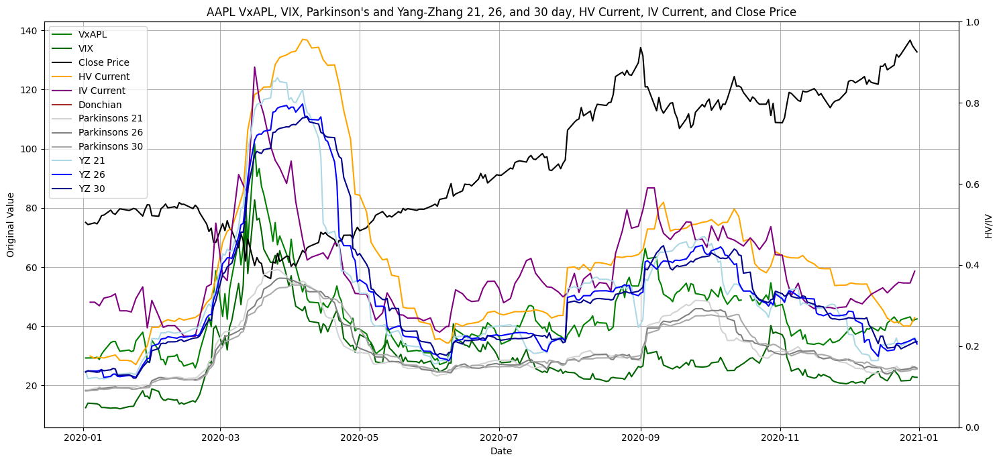

# Milestones

## 2025-02-17: Acquire Data Milestone

### Technology Plan

Our data is stored is stored online using DoltHub, an online data storage platform, which you can pull to your local machine via Dolt, a dynamic very similar to GitHub and Git. There is also some additional data from CBOE. From there, there is some initial setup using Python scripts to get the data working on your machine. After that, Python and R will be used to analyze the data. We are still brainstorming what technology we want to use for dashboarding, but have been considering Shiny, Dash, and Streamlit.

### Project Goals

Our capstone project aims at utilizing research in basic quantitative finance and economic principles to add indicator variables to our stock and options data. We plan to then cluster companies based on attributes we determine to be of most relevancy using various unsupervised learning techniques. With our clusters and full data set, we will then incorporate an array of different machine learning algorithms trained on implied volatility to, at a minimum, predict historical volatility metrics. If the aforementioned goals are achieved, we plan to make near-future predictions as well.

### Data Wrangling

So far, our team has been focused on extracting data from the database, joining base data with additional data, and generating technical indicators. We have written scripts that let us take the data from our dolt database tables and save them into csv files. From here, data manipulation is made easier. We have a couple scripts we are working on that let us 1. adjust stock prices based on stock splits, 2. generate technical indicators, 3. generate some more naive volatility metrics, and 4. joining these stock prices with CBOE data. We have also been doing some basic data exploration to find limitations of the dataset that we are using. One big limitation we have found is that our options and volatility data is not reported at consistent intervals. There is some data reported weekly, some reported every couple of days, and some reported daily, and there are a couple holes through the dataset. We are working on writing scripts to clean this so we have weekly data with no holes across a multi-year time frame.

### Team Evaluation

So far, the team is making good progress towards our end-of-semester goal of having a functioning dashboard. While we have not yet begun the actual dashboarding or front-end development process, the work we have done so far preparing our massive dataset into something interpretable by data processing Python packages has us in a good place heading into week 5. In terms of obstacles, we need to be better at team communication and making consistent progress. We need to make sure that all team members are on the same page as we continue going forward hashing out the details of our plan, and to do this we will need consistent communication inside and outside of class.

As of now, our team is making steady progress toward achieving the end-of-semester goal of delivering a fully functioning dashboard. Although we still have a lot of work left to do we have made big strides in gathering and structuring the data necessary for our needs. However, some obstacles could hinder our ability to meet both weekly and end-of-semester goals. One challenge is determining which models we will need to use to answer different kinds of research questions about the data we are doing the dashboard on. Additionally, the size of the data could be another challenge as it takes time to process certain code due to that fact. To overcome these obstacles, we plan to continue communicating in a problem solving fashion that is being supportive and focused on the goal. We will continue to collaborate closely to address technical challenges early on to ensure the smooth development of the dashboard.

## 2025-02-23: Project Goals Milestone

### Exploratory Analysis

We have been using the Polars library of Python for our data analysis, using it to turn our .csv files into dataframes and manipulating them with Python code. We've been making some initial exploratory plots in using MatPlot PyPlot. Our options data, which included the fields we intended to use as response variables, does not have data reported at consistent rates, so we will have to do some manipulation and use only weekly data here. So far, our exploration has involved generating and analyzing different technical indicators to see which ones are useful and which ones are redundant. We are narrowing in on which indicators will be useful for modeling volatility and which we can scrap. We have done some really basic visualizations while working on our exploration, but nothing that will end up in the final dashboard yet.

### Modeling Plan

For modeling, right now we are focused on doing further exploration of our variables and understanding what will actually go into our models, which will let us narrow down what model options work with our data. Our main modeling task involves stock data and technical indicators, as well as some realized volatility metrics, to model implied volatility and lagged realized volatility. We have also been considering utilizing some unsupervised learning models that can cluster our stocks, then we could create unique models for each cluster, so different categories of stocks can utilize slightly different models. Currently, we are working on finalizing our technical indicators and creating some of our more naive realized volatility metrics. There are industry standard models we could use for our initial volatility metrics, such as GARCH models, which may work well but wouldn't scale to match our project, so we're probably going to stick with simpler metrics like Jefferson's volatility and Yang-Zhang volatility. For our main modeling task, we are considering models like LSTM, LightGBM, and XGBoost, which would utilize the implied volatility or lagged realized volatility as response variables, and we could use our stock data and indicators as explanatory variables. We need to make sure that we aren't double dipping into our data and using adequate train and test splits. If we use a more advanced model like LSTM or Prophet, we will also need to do some more research to understand what retraining or finetuning is necessary.

### Project Goals

Our target audience includes students, researchers, and investors who are interested in learning about what factors impact stock volatility and in which areas predicting volatility can be important for pricing derivatives. We will continue to research what kind of models would work best to be used within a dashboard. We haven't started dashboarding yet, but as we implement some naive volatility metrics, we can begin creating different views for our dashboard. We have also been exploring other dashboarding projects out on the internet which involve futures and portfolio management, and gathering ideas on what might be good to implement into our dashboard. Some of the details are subject to change as we complete more research, but overall, the next few weeks will be focused on selecting technical indicators, volatility metrics, and mapping out our modeling procedures.

### Project Progress

So far, each team member has contributed to research on the project topic. Not everybody has committed changes to GitHub, as some of the team is still learning about how version control systems. Everyone on the team has their local tech stack ready and has confirmed that the scripts in the repo run correctly on their local systems. The next steps for the project are to pick appropriate models and finish finding the most important technical indicators. Individually, team members are currently split between focusing on technical indicator research, improving existing scripts, and exploring naive volatility metrics that can be used for our models. For communication, we have been discussing progress updates and project trajectory in the Discord, and all team members have been communicative. Moving forward, each team member has a clear plan for their next steps, and we are all on the same page about next steps for the project.

## 2025-03-02: Exploratory Analysis Milestone

### Brainstorm Dashboard

Our dashboard will be aimed at providing interactive insights into volatility of different stocks. The user should be able to choose a stock and a date (or date range), and have a few different ways to visualize our modeled volatility for that period. We plan on adding features so that the user is able to look at historical volatility and compare to our modeled volatilities. We want users to be able to see what factors impact volatility, and then see how volatility impacts things like derivative pricing, portfolio risk management, and statistical arbitrage opportunities. Past this, we have a few dashboards already that we are planning on using as inspiration and will continue to brainstorm the intricacies of the dashboard as our project materializes in the next week or two.

### Data Report

Our dataset contains time series data for over 2000 equities, including daily open, high, low, and close prices, and volume. This dates back to 2011. The database we get this from also has some information on derivatives and stock splits on the same tickers. We have a second dataset which contains some CBOE volatility metrics, also reported daily since 2011 (some of the metrics are reported earlier as well). Finally, we have a third dataset containing option chain and volatility data for over 2000 equities reported weekly since 2019. We have lots of data, but by using Polars and doing clever data engineering techniques, it's definitely manageable. We are using the ohlcv data, and we start by applying the split ratios found in the stock splits table so that our prices and volume are adjusted appropriately. Then, we generate different technical indicators and volatility metrics using polars on the ohlcv data. We finish by joining this to the different cboe data csvs, so that the daily volatility metric data is appended to our dataframe. This data should be enough for our applications. We are currently exploring whether or not we will really need to use the options side of the data (discussed further in Exploratory Analysis) since the tables there are massive compared to the rest of the datasets. 

### Project Progress

So far, the team has been focused on finalizing features for modeling. We have been building out technical indicators and volatility metrics from our base data, and cleaning and consolidating data where needed. We have started on exploratory analysis and looking at feature selection techniques for further narrowing down and refining our feature set. The project has been very research-heavy so far, with different team members exploring the math and industry knowledge that has driven development of the technical indicators we are using, but we are starting to head in a more standard visualization and exploration direction. For next steps, we are considering feature selection and clustering approaches, trying to decide what models are most applicable for our data, creating extensive documentation of our generated features, and making a decision on what our response variable will be (we have a couple different options including historical variance and implied volatility, and we might even use a generated volatility metric as our response variable). Once we finalize these decisions, the modeling task becomes tangible. The team is communicating well, it has been a slow week since we all had exams and other class work due this week, but we are ready for a big push this week.

### Exploratory Analysis

Our dataset contains time series data for over 2000 equities, including daily open, high, low, and close prices, and volume. This dates back to 2011. The database we get this from also has some information on derivatives and stock splits on the same tickers. We have a second dataset which contains some CBOE volatility metrics, also reported daily since 2011 (some of the metrics are reported earlier as well). Finally, we have a third dataset containing option chain and volatility data for over 2000 equities reported weekly since 2019. One issue that we have found with our data is that some equities have been removed from the market between the dataset's creation and now, while others have been added to the market after the dataset's creation. We will likely have to remove both of these kinds of data, as otherwise we will have lots of 'N/A' values. In terms of important features that we are finding, we have been looking into different volatility metrics, and have found that Yang-Zhang volatility provides results very close to the historical variance data derived from options prices. If we are able to get a volatility metric working well enough, we could simply lag this metric and use it as our response variable, letting us utilize the daily data for training instead of relying on the weekly data for our response variable. We are still exploring volatility metrics and determining if this is really a good idea or not.

