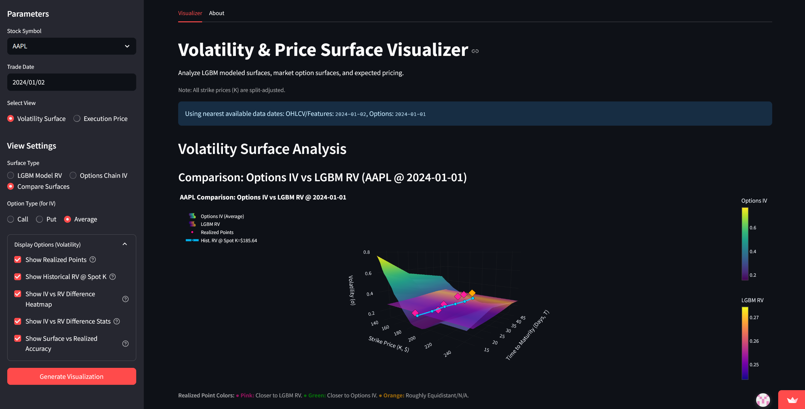
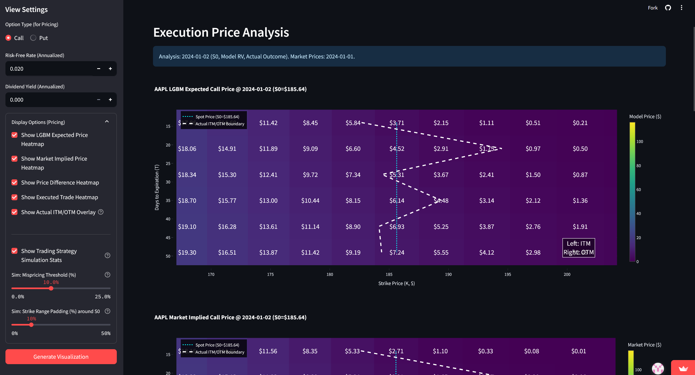
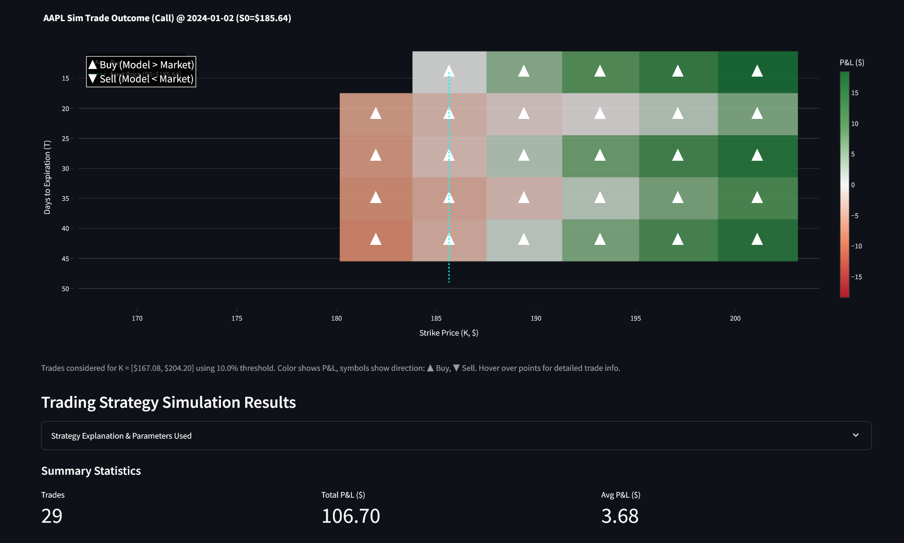
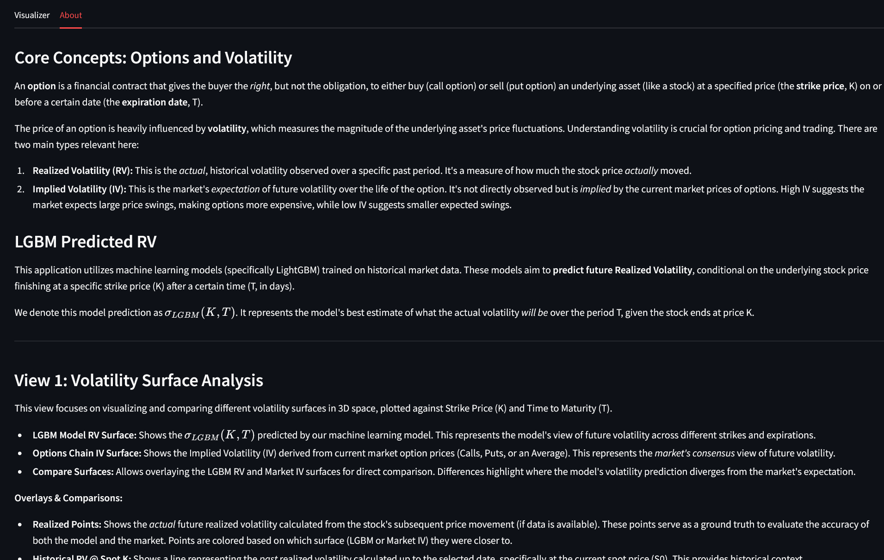
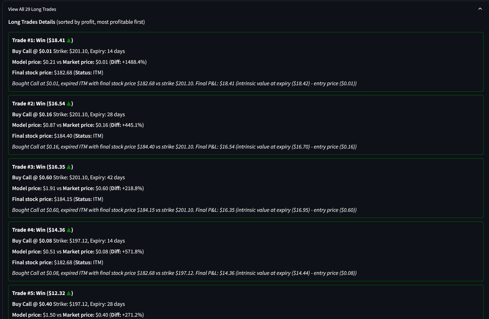

# Volatility and Price Surface Modeling and Visualization

**Team:** DERN (Ryan Freidhoff, Nic Rhoads, Dakota Rossi, Emiliano Saucedo)

**Dashboard Link:** [Volatility Dashboard](https://ds401-dern-volatility-dashboard.streamlit.app/)

**Repository Link:** [GitHub Repository](https://github.com/nrhoads02/ds401-project)

## Table of Contents

- [Volatility and Price Surface Modeling and Visualization](#volatility-and-price-surface-modeling-and-visualization)
  - [Table of Contents](#table-of-contents)
  - [1. Application Goal](#1-application-goal)
    - [1.1. Project Objective](#11-project-objective)
    - [1.2. Understanding Key Concepts: Volatility and Options](#12-understanding-key-concepts-volatility-and-options)
    - [1.3. Motivation and Target Audience](#13-motivation-and-target-audience)
  - [2. Data Pipeline (The Backend)](#2-data-pipeline-the-backend)
    - [2.1. Data Collection (ETL)](#21-data-collection-etl)
      - [2.1.1. Data Sources](#211-data-sources)
      - [2.1.2. Data Acquisition](#212-data-acquisition)
      - [2.1.3. Data Cleaning and Preprocessing](#213-data-cleaning-and-preprocessing)
      - [2.1.4. Data Transformation](#214-data-transformation)
      - [2.1.5. Data Storage for Dashboard](#215-data-storage-for-dashboard)
    - [2.2. Modeling](#22-modeling)
      - [2.2.1. Modeling Goal and Purpose](#221-modeling-goal-and-purpose)
      - [2.2.2. Investigated Approaches (Not Used)](#222-investigated-approaches-not-used)
      - [2.2.3. Final Model: LightGBM for Conditional Realized Volatility](#223-final-model-lightgbm-for-conditional-realized-volatility)
    - [2.3. Dashboard Construction](#23-dashboard-construction)
      - [2.3.1. Technology Used](#231-technology-used)
      - [2.3.2. Dashboard Layout, Logic, and Outputs](#232-dashboard-layout-logic-and-outputs)
      - [2.3.3. User Inputs and Interactivity](#233-user-inputs-and-interactivity)
      - [2.3.4. Technology Assessment](#234-technology-assessment)
  - [3. Application Learning](#3-application-learning)
    - [3.1. Key Learnings](#31-key-learnings)
    - [3.2. Choices Made](#32-choices-made)
    - [3.3. Model Support for Goals](#33-model-support-for-goals)
  - [4. Discussion](#4-discussion)
    - [4.1. Project Summary](#41-project-summary)
    - [4.2. Next Steps](#42-next-steps)
    - [4.3. Unique Aspects](#43-unique-aspects)
    - [4.4. Limitations](#44-limitations)
    - [4.5. Availability](#45-availability)

## 1. Application Goal

### 1.1. Project Objective

The primary goal of this project was to develop a tool for analyzing and visualizing stock volatility. Specifically, we aimed to:

1. Model future **Realized Volatility (RV)**, which is the actual, observed volatility of a stock over a future period, conditional on the stock price ending at a specific strike price ($K$) after a certain time ($T$, in days). We denote this model prediction as $\sigma_{LGBM}(K, T)$.
2. Compare this model-predicted RV against **Implied Volatility (IV)**, which is the market's expectation of future volatility derived from current option prices.
3. Visualize these volatilities as 3D surfaces plotted against strike price ($K$) and time to maturity ($T$).
4. Extend the analysis to theoretical option pricing using the Black-Scholes-Merton (BSM) model, comparing model-based prices to market-implied prices to identify potential discrepancies.
5. Present these analyses in an interactive dashboard suitable for educational and exploratory purposes.

### 1.2. Understanding Key Concepts: Volatility and Options

To fully appreciate the project, a few foundational concepts are essential, especially for those new to financial markets.

**Options Contracts:** An option is a financial contract that gives the buyer the *right*, but not the obligation, to either buy (a "call" option) or sell (a "put" option) an underlying asset, such as a stock, at a specified price (the **strike price**, denoted as $K$) on or before a certain date (the **expiration date**, denoted as $T$). The price of an option is influenced by several factors, with volatility being one of the most critical.

**Volatility:** In finance, volatility is a statistical measure of the dispersion of returns for a given security or market index. In simpler terms, it quantifies how much the price of an asset is likely to fluctuate over a given period. Higher volatility means the price can swing dramatically, while lower volatility suggests more stable prices. There are several ways to measure and interpret volatility:

- **Realized Volatility (RV):** This is the *actual* volatility observed in a stock's price movements over a specific *past* period. It's a historical measure. In this project, we aim to *predict future* Realized Volatility.
  - **Our Project's RV Calculation:** We calculate a daily measure of realized variance using a method that accounts for intraday price ranges and overnight price jumps, often referred to as a "Parkinson-plus-jumps" approach. The daily realized variance is composed of three main parts:
      1. **Intraday Parkinson Component:** Captures volatility during trading hours, based on the high and low prices of the day. Calculated as: $\frac{1}{4 \ln 2} \left(\ln\left(\frac{\text{High}}{\text{Low}}\right)\right)^2$.
      2. **Open-to-Close Jump Component:** Measures the volatility from the market open to market close. Calculated as: $\left(\ln\left(\frac{\text{Close}}{\text{Open}}\right)\right)^2$.
      3. **Overnight Jump Component:** Accounts for price changes between the previous day's close and the current day's open. Calculated as: $\left(\ln\left(\frac{\text{Open}}{\text{Close}_{\text{prev}}}\right)\right)^2$.
  - The sum of these three components gives our daily realized variance, which we named `parkinson_plus_jumps_daily` in our codebase. *(Refer to [`src/data_transformation/technical_indicators.py`](src/data_transformation/technical_indicators.py) and [`src/data_transformation/INDICATORS.md`](src/data_transformation/INDICATORS.md) for precise formulas and implementation details of these components).*
  - This daily variance is then summed over a future prediction horizon of $h$ trading days to obtain the variable `rv_hd_future`. The annualized Realized Volatility ($\sigma$) that our model predicts is then derived from this future variance: $\sigma = \sqrt{\texttt{rv\\_hd\\_future} / (h/252.0)}$, assuming 252 trading days in a year.

- **Implied Volatility (IV):** This is the market's *expectation* of future volatility over the life of an option. It is not directly observed but is "implied" by the current market prices of options. If options are expensive, it implies the market expects high volatility, and vice-versa. Our dashboard compares our model's RV predictions against this market-derived IV.

- **VIX (CBOE Volatility Index):** Often referred to as the "fear index," the VIX is a widely followed measure of the stock market's expectation of volatility based on S&P 500 index options. We incorporate VIX and similar CBOE indices as features in our model because they provide a broad sense of market sentiment regarding volatility.

**Log-Moneyness ($k$):** In options analysis, moneyness describes the relationship between an option's strike price and the current price of the underlying asset. Log-moneyness, denoted as $k$, is often defined as $k = \ln(K/S_0)$, where $K$ is the strike price and $S_0$ is the current stock price. It provides a standardized way to represent how far an option's strike is from the current price. Our model predicts RV conditional on this $k$. For training purposes, we use `log_ret_future_h` as its proxy, where $k = \ln(S_T/S_0)$ with $S_T$ being the stock price at the future horizon $h$.

**Black-Scholes-Merton (BSM) Model:** The BSM model is a well-known mathematical model used to determine the theoretical price of European-style options. It considers factors like the underlying stock price, strike price, time to expiration, risk-free interest rate, dividend yield, and importantly, the expected volatility of the stock. In our project, we use the BSM model to translate different volatility estimates (our predicted RV and market IV) into theoretical option prices, allowing for comparison and analysis.

### 1.3. Motivation and Target Audience

Volatility is a cornerstone concept in finance, particularly in options trading, risk management, and portfolio construction. Understanding how volatility behaves across different strike prices and time horizons (the "volatility surface") provides insights crucial to applications like trading with derivatives.

Our target audience includes fellow Data Science students, finance students, researchers, and potentially retail investors interested in:

- Learning about different types of volatility and their implications.
- Exploring how machine learning models can be applied to predict financial metrics like volatility.
- Visualizing the complex relationship between volatility, strike price, and time.
- Understanding the connection between volatility surfaces and option pricing.
- Seeing a practical example of building a data pipeline and dashboard for financial analysis, especially handling large datasets.

## 2. Data Pipeline (The Backend)

Detailed financial data can consume massive amounts of resources like storage and memory. Therefore, ensuring that we have a robust, efficient, and scalable data pipeline is essential for a project of this nature. Our pipeline was developed to handle the initial extraction, cleaning, transformation, and final storage of data in a format suitable for both modeling and efficient dashboard operation.

### 2.1. Data Collection (ETL)

The Extract, Transform, Load (ETL) process formed the foundation of our project, involving several stages to prepare the data for analysis and modeling. This systematic approach ensured that raw data from various origins was consistently processed into a usable format.

#### 2.1.1. Data Sources

Our project utilized several data streams to gather a comprehensive financial dataset. Initially, our primary stock and options data were sourced from public **DoltHub Repositories**. DoltHub functions similarly to GitHub but is specifically optimized for versioning large datasets, which was advantageous for handling extensive financial records. The `stocks` database provided daily Open, High, Low, Close, and Volume (OHLCV) data, along with stock split and dividend information for over 2000 equities, with some records potentially dating back to 2011 (see [`data/raw/stocks`](data/raw/stocks) for structure details). Concurrently, the `options` database contained option chain data, including quotes and associated risk parameters (Greeks like delta), as well as historical volatility metrics, generally reported weekly since 2019 (see [`data/raw/options`](data/raw/options)).

As an auxiliary source, we incorporated **CBOE Index Data** by downloading historical data for various Chicago Board Options Exchange (CBOE) volatility indices, such as the VIX and VVIX. These were obtained directly as CSV files from the CBOE website and stored in our project at [`data/raw/cboe`](data/raw/cboe).

However, due to performance and deployment constraints encountered when accessing DoltHub directly from the dashboard environment, the core data (OHLCV, options, splits) was ultimately processed into **Partitioned Apache Parquet Files**. These files, stored within our GitHub repository, became the final and primary source for the Streamlit application, offering a more efficient data access method (details in [`data/parquet/`](data/parquet/)).

#### 2.1.2. Data Acquisition

The methods for acquiring data varied depending on the source. For the **Dolt** data, we initially cloned the repositories from DoltHub using the Dolt command-line interface. Following this, Python scripts, such as the one found at [`src/data_extraction/dolt_csv_export.py`](src/data_extraction/dolt_csv_export.py), were employed to export specific tables from our local Dolt databases into CSV files. This conversion facilitated easier manipulation and exploration during the early stages of development.

The **CBOE** index data involved a more manual process, where CSV files were downloaded directly from their official website.

For the final dashboard application, the data loading mechanism shifted. We developed a custom Python module, located at [`src/data_extraction/dataframe_loader.py`](src/data_extraction/dataframe_loader.py), specifically designed to efficiently read data from the partitioned Parquet files that were stored within the project's GitHub repository. This custom loader was crucial for the performance of the deployed application.

#### 2.1.3. Data Cleaning and Preprocessing

Before the raw data could be effectively used for feature engineering and subsequent modeling, a couple of crucial cleaning and preprocessing steps were necessary.

A primary concern was the integrity of the stock split data. The raw data contained some duplicate entries for the same split event, which could lead to inconsistencies in price and volume adjustments. To address this, we implemented logic to identify such duplicates and retain only the most recent, presumably most accurate, record for each unique split event. This process is detailed within our script [`src/data_transformation/stock_adjustments.py`](src/data_transformation/stock_adjustments.py).

Another important consideration was the completeness of ticker histories. We observed that some stocks had incomplete price and volume data within our defined analytical timeframe; for instance, some might have been delisted before the end date, listed after the start date, or had intermittent missing OHLCV values. To ensure data consistency for reliable time-series analysis, we applied a filter to include only those tickers that were actively trading and had complete OHLCV records on both the first and last dates of our dataset, with no missing values in between. This logic, also found in the `stock_adjustments.py` script, while vital for ensuring data quality, consequently reduced the total number of available stocks for the final analysis.

#### 2.1.4. Data Transformation

The core of our data preparation lay in transforming the cleaned OHLCV data by enriching it with a variety of features deemed relevant for volatility modeling. This multi-faceted process was orchestrated as follows:

First, **Split Adjustments** were applied. Historical OHLCV prices and volumes, as well as option strike prices from the options dataset, were rigorously adjusted to account for any stock splits that occurred. This involved using the cleaned split data to calculate a reverse cumulative adjustment factor unique to each stock. This procedure, detailed in [`src/data_transformation/stock_adjustments.py`](src/data_transformation/stock_adjustments.py), is fundamental for ensuring that price and volume data are historically comparable and not distorted by split events.

Next, an extensive array of **Technical Indicators** was computed from the split-adjusted OHLCV data. For these calculations, we utilized the Polars library, chosen for its high performance and efficiency in handling large datasets. The generated indicators included various types of moving averages (Simple and Exponential), rolling standard deviations, the Relative Strength Index (RSI), Average True Range (ATR), our custom-defined realized variance measures (as detailed in Section 1.2), and several volume-based indicators like On-Balance Volume (OBV) and Volume-Weighted Average Price (VWAP). A comprehensive list of all indicators, along with their specific formulas and calculation methods, can be found in our detailed documentation at [`src/data_transformation/INDICATORS.md`](src/data_transformation/INDICATORS.md).

A critical step for our predictive modeling was **Target Variable Generation**. To train our models to forecast future volatility, we needed to create appropriate target variables. This involved calculating future realized volatility (which we named `rv_hd_future` in our dataset) and future log returns (`log_ret_future_h`). These were derived by shifting the already computed `rv_hd` (a rolling sum of daily realized variance) and rolling log returns forward by $h$ days, where $h$ represents the specific prediction horizon. These forward-shifted values served as the direct precursors to the model's ultimate target variable, $\sigma$ (the annualized future RV), and the primary conditional variable, log-moneyness ($k$).

To incorporate broader market sentiment regarding volatility, we performed **CBOE Index Joining**. Data from the CBOE volatility indices (such as VIX) was left-joined to our main stock dataframe. This join was executed on the `date` column, effectively aligning these market-wide volatility measures with the daily stock-specific data. The script responsible for this is [`src/data_transformation/cboe_index_join.py`](src/data_transformation/cboe_index_join.py).

Finally, all these transformation steps - split adjustments, indicator generation, target variable creation, and CBOE data joining - were consolidated and orchestrated by a single **pipeline function**. This function, located in [`src/data_transformation/transformation_pipeline.py`](src/data_transformation/transformation_pipeline.py), was designed to leverage Polars' lazy evaluation and streaming capabilities. This approach allowed for the efficient processing of our large dataframes, minimizing memory consumption while ensuring all transformations were applied consistently.

#### 2.1.5. Data Storage for Dashboard

Handling our large datasets for the interactive dashboard presented a significant technical challenge. Our raw datasets, even before the addition numerous technical indicators, were several gigabytes in size. Storing these as monolithic CSV files directly within our GitHub repository was impractical due to GitHub's file size limitations. Furthermore, attempting to access them directly from DoltHub within the Streamlit Cloud environment, which has its own resource constraints (especially on memory and processing time), proved to be too slow and unreliable for maintaining a responsive user experience.

Our adopted solution was to convert the essential datasets—OHLCV, split-adjusted options data, and stock split records—into the Apache Parquet format. This conversion was managed by our script [`src/data_extraction/parquet_converter.py`](src/data_extraction/parquet_converter.py). The Parquet format offers two key advantages: efficient columnar storage and effective compression, both of which significantly reduced the overall file footprint. More importantly, we implemented a partitioning strategy for these Parquet files. The data was divided based on the stock symbol (`act_symbol`), resulting in a fixed number of smaller, more manageable partition files for each distinct dataset.

To facilitate efficient data loading from these partitioned files, we generated metadata files (in `partition_metadata.json` format for each dataset type) that map each stock symbol to its corresponding partition file(s). Our custom data loader, detailed in [`src/data_extraction/dataframe_loader.py`](src/data_extraction/dataframe_loader.py), utilizes this metadata. When a user selects a particular stock in the dashboard, the loader intelligently reads *only* the necessary partition files that contain that specific stock's data, rather than attempting to load the entire multi-gigabyte dataset into memory. This selective loading approach drastically reduced memory usage and data load times within the Streamlit application. Consequently, this allowed us to store the processed data within GitHub's repository limits (as individual partition files were smaller) and, crucially, to maintain fast and responsive dashboard performance for the end-user.

### 2.2. Modeling

With the data prepared, the next phase focused on developing predictive models for future realized volatility.

#### 2.2.1. Modeling Goal and Purpose

The central modeling effort aimed to **predict future realized volatility surfaces**. The purpose of this model is predictive: given the market conditions and a suite of technical indicators observed up to a specific trade date, the model estimates the expected realized volatility ($\sigma$) over a defined future horizon ($T$), conditional on the stock price ultimately reaching a specific strike price ($K$) relative to its starting price ($S_0$).

This predicted surface, denoted as $\sigma_{LGBM}(K, T)$, serves multiple key purposes within our application. Firstly, it allows for **direct visualization** of the model's expectation of the future volatility structure across different strikes and maturities. Users can observe how the model anticipates volatility to change as the strike price and time to expiration vary. Secondly, it enables **comparison with market-implied volatility (IV)**. By highlighting discrepancies between the model's RV prediction and the market's IV (derived from option prices), the tool can help identify potential mispricings or areas where the model's forecast diverges significantly from market consensus. This comparative analysis is a core feature of the dashboard. Lastly, the predicted volatility acts as a critical **input for option pricing**. The $\sigma_{LGBM}(K, T)$ values are fed into the Black-Scholes-Merton model to generate theoretical option prices based on our model's specific volatility forecast, which can then be compared to actual market option prices.

#### 2.2.2. Investigated Approaches (Not Used)

During the course of our project, we explored several alternative modeling approaches before finalizing our choice of LightGBM. **GARCH (Generalized Autoregressive Conditional Heteroskedasticity) models**, while a standard and well-respected method for modeling time-series volatility in finance, were considered. We had ideas initially to use a GARCH or eGARCH model for our main modeling tasks, then considered using GARCH as a parameter in a larger machine learning model. However, given the scope of our dashboard, which aimed to cover a large number of stocks, and the size of our dataset, fitting potentially thousands of individual GARCH models (e.g., one per stock, with rolling windows to avoid data leakage) was deemed too computationally expensive and time-consuming.

We also initially considered **XGBoost**, another powerful and popular gradient boosting framework. While XGBoost is highly effective for many machine learning tasks, our early experiments and comparisons suggested that LightGBM could offer comparable, if not slightly better, performance for our specific problem, often with the added benefit of faster training times on large datasets. This led us to focus our development efforts on LightGBM.

**Neural Network approaches**, particularly those incorporating Long Short-Term Memory (LSTM) layers, are theoretically very well-suited for sequence data like financial time series. We investigated this avenue, recognizing their potential to capture complex temporal dependencies. However, our experiments revealed that training these types of models to a satisfactory level of performance would be significantly slower and more resource-intensive than gradient boosting methods, making them less practical for the project's timeframe and the desired speed of iteration for model updates or retraining.

Lastly, our initial conceptualization for generating the volatility surface involved an **ad-hoc SVI (Stochastic Volatility Inspired) approach**. The idea was to model and predict Heston-like parameters (such as variance, speed of mean reversion, volatility of volatility, and correlation) which would then be used in an SVI-style equation to construct the surface. While this method did produce visually appealing and smooth surfaces, we found that the results were difficult to interpret directly in the context of realized volatility. SVI models are primarily designed to fit and parameterize *implied* volatility surfaces observed in the market, and adapting this framework to our goal of predicting *realized* volatility did not align cleanly with our ultimate objectives of comparison and direct RV forecasting. This realization led us to pivot towards a 'local volatility' style interpretation, attempting to model the realized volatility surface more directly point-by-point using a machine learning model conditioned on strike and time.

#### 2.2.3. Final Model: LightGBM for Conditional Realized Volatility

Our final modeling choice was the LightGBM (Light Gradient Boosting Machine), a decision driven by its efficiency and strong performance on large, tabular datasets, making it well-suited for our project's scale and objectives.

The **response variable** for our model is the Future Annualized Realized Volatility ($\sigma$). This is derived from the `rv_hd_future` variable (which represents the sum of daily Parkinson-plus-jumps variances over an $h$-day future horizon) using the formula: $\sigma = \sqrt{\texttt{rv\\_hd\\_future} / (h/252.0)}$, where $h$ is the prediction horizon in trading days, and 252 is the assumed number of trading days in a year.

The [**explanatory variables**](src/data_transformation/INDICATORS.md) used to predict this $\sigma$ encompass a wide array of features carefully engineered to capture relevant market dynamics:
A comprehensive set of technical indicators, detailed in our documentation, calculated from historical OHLCV data;
Values from joined CBOE volatility indices (e.g., VIX), providing a measure of overall market sentiment;
Log-moneyness, defined as $k = \ln(K/S_0)$, which for training purposes corresponds to the `log_ret_future_h` variable (the log return over the horizon $h$); this conditions the volatility prediction on the future stock price outcome relative to the current price.
Interaction terms, such as $k^2$, $k \times \text{VIX}$, and $k \times \text{RV}$ (Realized Variance), were explicitly created to help the model capture non-linear relationships and patterns, like the volatility smile or skew, that are characteristic of volatility surfaces.
Before model training, a predefined set of features that were identified through analysis as having consistently low importance or being redundant for prediction were explicitly removed to streamline the model and potentially improve generalization.

The **model description** and our specific implementation details, including the training pipeline and prediction logic, can be found in the script [`src/data_modeling/surface_lgbm_modeling.py`](src/data_modeling/surface_lgbm_modeling.py). Several key characteristics define our LightGBM setup:
We trained distinct and independent models for each future horizon ($h \in \{10, 15, \dots, 35\}$ days). This approach allows each model to specialize in capturing the patterns and feature relationships most relevant to its specific forecast period, rather than trying to create a single model that generalizes across all horizons.
An A/B cross-validation scheme was employed to ensure robust model evaluation and prevent look-ahead bias. All available stock symbols were randomly divided into two groups (Group A and Group B). For each horizon $h$, two separate models were trained: Model A was trained using data from Group B stocks and validated on Group A stocks, while Model B was trained using data from Group A stocks and validated on Group B. When the dashboard needs to make a prediction for a user-selected stock, it loads the appropriate model (either A or B) that specifically *excluded* that particular stock from its training set, providing a more genuine out-of-sample prediction.
To improve the model's ability to learn the nuances of the volatility smile and skew (where volatility can be higher for options further away from the current stock price), training samples were weighted based on the absolute value of their log-moneyness ($|k|$). This gives more emphasis during training to observations that are further out-of-the-money or in-the-money.
We leveraged GPU acceleration for the LightGBM training process. This significantly reduced the computation time required to train the numerous models across all horizons and A/B splits.
The hyperparameters for LightGBM were optimized with large datasets in mind, featuring parameters such as a high number of leaves per tree (`num_leaves`), a small learning rate to allow for more gradual learning, and the use of early stopping criteria during training to prevent overfitting and select the optimal number of boosting rounds.

The **software implementation** was entirely in Python. We relied heavily on the `lightgbm` library for the core modeling tasks, `polars` for its high-performance data manipulation capabilities, `numpy` for numerical operations underlying feature creation and model inputs, and `joblib` for efficiently saving and loading model metadata.

Regarding **model estimation and storage**:
All models are pre-estimated offline, a necessity given the substantial time required for training the full suite of models.
The trained LightGBM booster objects (the actual model files) are saved to disk. To manage file sizes effectively, particularly for storage within GitHub's typical limits, models are compressed using `zlib` and stored with a `.lgb.z` extension if they exceed a predefined size threshold. The current version of the models has all modeling files stored in a `zlib` compressed format.
These model files, along with their associated metadata (which includes details like the feature names used for each horizon and the specific A/B stock splits), are organized into dated subdirectories within the [`data/models/surface_lgbm/`](data/models/surface_lgbm/) path in our repository.
The dashboard application then dynamically loads these required pre-trained models using parallel processing techniques to enhance responsiveness when a user requests a new prediction.

In terms of observed **model performance**:
Training the complete set of models for all horizons on our full dataset (which involved using a stride of 1 for sampling the time-series data) took approximately 5 hours on the available hardware.
Across the different prediction horizons, the Root Mean Squared Error (RMSE) for the predicted volatility $\sigma$ typically ranged from 0.32 to 0.37. The $R^2$ values, which measure the proportion of variance explained by the model, were high, ranging from 0.475 to 0.565. This indicates that the models were able to capture a substantial portion of the variability in future realized volatility.
An interesting observation from analyzing the feature importances provided by LightGBM was that $k$-related features (log-moneyness and its interaction terms) were generally less important than initially anticipated by our hypothesis. This may have contributed to the model producing volatility smiles and skews that appeared somewhat flatter than those typically observed in actively traded implied volatility markets.

### 2.3. Dashboard Construction

The dashboard serves as the interactive front-end for users to explore the volatility surfaces and pricing analyses generated by our backend pipeline and models.

#### 2.3.1. Technology Used

The dashboard was built using **Streamlit** as the primary web application framework, chosen for its ease of use and strong integration with Python, which was the language for all our backend processing. The machine learning models were developed using **LightGBM**. Data manipulation throughout the project relied heavily on the efficiency of **Polars** and the numerical capabilities of **NumPy**. Interactive visualizations, particularly the 3D surfaces and 2D heatmaps central to the dashboard's purpose, were created using **Plotly**. While initial data sourcing involved **Dolt** databases, the final application primarily accessed data stored in the **Parquet** file format for performance reasons. The entire application is hosted on the Streamlit Community Cloud platform.

#### 2.3.2. Dashboard Layout, Logic, and Outputs

The dashboard is organized into multiple views, selectable via a sidebar radio button, providing a structured user experience. The primary Python script orchestrating the user interface and application flow is [`streamlit_app.py`](streamlit_app.py).

The **Volatility Surface View**, with its logic primarily contained in [`dashboard/surface_view.py`](dashboard/surface_view.py), is dedicated to the visualization and comparison of different volatility surfaces. Users can choose to display the LightGBM model's predicted Realized Volatility (RV), the market's Implied Volatility (IV) surface (derived from options chain data), or a direct comparison of these two. This view prominently features interactive 3D Plotly surfaces. It also provides options to overlay contextual data, such as 3D scatter plots of actual realized volatility points (if available for the selected future period) and 3D lines representing the historical RV at the current spot price. When in comparison mode, this view additionally presents a 2D Plotly heatmap showing the percentage difference between the IV and the model's RV, alongside summary tables and metrics comparing the average differences between these surfaces and the observed realized points.

*Figure 1: Volatility Surface View comparing LGBM-predicted Realized Volatility (RV) to Market Implied Volatility (IV). This 3D plot highlights differences in volatility expectations across strikes and maturities.*

The **Execution Price View**, managed by the code in [`dashboard/price_view.py`](dashboard/price_view.py), takes the volatility surfaces from the previous view and translates them into theoretical option prices using the Black-Scholes-Merton (BSM) model. This view displays a series of interactive 2D Plotly heatmaps. These include visualizations of the LGBM model-implied theoretical option price, the market-implied theoretical option price (derived from market IV), and the dollar difference between these two prices. A key feature of this view is a simple trading strategy simulation, which operates based on identified discrepancies between the model and market prices. The outcomes of these simulated trades (e.g., buy/sell actions, profit/loss) are also visualized on a heatmap. An important overlay available in this section is a line indicating the actual In-The-Money (ITM) / Out-of-The-Money (OTM) boundary, which is derived from the stock's actual price movement over the option's life. Users can adjust BSM model parameters and the settings for the trading simulation here. Furthermore, this view presents summary metrics and tables detailing the results of the trading strategy simulation, such as total Profit & Loss (P&L) and Win Rates.

*Figure 2: Execution Price View showing heatmaps of theoretical option prices derived from model-predicted and market-implied volatility.*

*Figure 3: Simulated trading decisions and resulting P&L, based on differences between model-predicted and market-implied prices.*

Finally, an **About Tab**, integrated within the main [`streamlit_app.py`](streamlit_app.py) script, provides textual context and definitions for key financial terms and explains the dashboard's various functionalities. This section aims to help users, especially those less familiar with financial markets or volatility modeling, to better understand the analyses presented.

*Figure 4: 'About' tab of the dashboard provides a concise reference for volatility concepts, model interpretation, and surface definitions.*

This multi-view layout, combined with dynamic updating of all outputs based on user inputs, allows users to focus on either direct volatility analysis or its implications for option pricing and trading strategies, facilitating an exploratory and educational experience.

#### 2.3.3. User Inputs and Interactivity

The dashboard is designed to be highly interactive, offering a range of user inputs to customize the analysis.

Globally, across all views, users can:

- Select the **Stock Symbol** from a comprehensive dropdown list, allowing analysis for a specific company.
- Specify the **Trade Date** using an intuitive calendar input, which sets the reference point for all historical data lookups and future predictions.
- Choose the main analysis mode via a **View Selection** radio button, switching between the "Volatility Surface" view and the "Execution Price" view.

Within the **Volatility Surface View**, further specific inputs are available:

- Users can select the **Surface Type** to be displayed (LGBM Model RV, Options Chain IV, or a direct Comparison of both) using radio buttons.
- When dealing with options-derived data (IV or Comparison), the **Option Type for IV** (Call, Put, or an Average of both) can be specified.
- A set of checkboxes under "Display Options" allows users to toggle various graphical overlays and analytical elements. These include "Show Realized Points" (plotting actual future RV if data exists), "Show Historical RV @ Spot K" (displaying a line of past RV at the current stock price), and, when in "Compare Surfaces" mode, options to "Show IV vs RV Difference Heatmap" and related "Difference Stats," as well as a comparison of "Surface vs Realized Accuracy."

In the **Execution Price View**, users can tailor the option pricing and simulation:

- The **Option Type for Pricing** (Call or Put) is selected for all BSM calculations and the trading simulation.
- Numerical inputs are provided for key **BSM Parameters**, namely the Risk-Free Interest Rate and the stock's Dividend Yield.
- "Display Options" in this view consist of checkboxes to toggle the visibility of various heatmaps: "Show LGBM Expected Price Heatmap," "Show Market Implied Price Heatmap," "Show Price Difference Heatmap," and "Show Executed Trade Heatmap." An overlay for the "Show Actual ITM/OTM Overlay" can also be activated.
- For the trading strategy analysis, users can choose to "Show Trading Strategy Simulation Stats." The simulation itself is controlled by sliders for the **Mispricing Threshold (%)**, which sets the sensitivity for triggering hypothetical trades, and the **Strike Range Padding (%) around S0**, defining the range of strike prices relative to the spot price where trades are considered.

*Figure 5: Detailed breakdown of individual trades from the pricing simulation, including entry price, model/market delta, and final P&L.*

These extensive input options allow users to dynamically explore different scenarios, stocks, and timeframes, making the dashboard a flexible tool for learning and analysis.

#### 2.3.4. Technology Assessment

Our choice of **Streamlit** for the dashboard framework and hosting proved highly effective, primarily due to its seamless Python integration and the ability it afforded for rapid development and iteration. Creating interactive widgets (like sliders, buttons, and selectboxes) and managing the page layout using columns, tabs, and expanders was generally straightforward and intuitive. However, a key lesson learned was that Streamlit's performance is heavily dependent on the efficiency of the underlying Python code, particularly concerning data loading and processing. Our initial challenges with handling large datasets necessitated significant optimization efforts, most notably the transition from direct Dolt/CSV access to a partitioned Parquet data backend. The resource limitations of the Streamlit Community Cloud environment (e.g., available RAM) also reinforced the critical need for this data handling efficiency. On the positive side, deployment of the application via GitHub integration was remarkably simple and user-friendly.

For creating the visualizations, **Plotly** was an excellent choice. It enabled the development of highly interactive, publication-quality plots, which was especially important for the complex 3D surfaces central to our project's theme. Plotly offers a great deal of fine-grained control over the appearance of plots and the information displayed upon user interaction (e.g., hover tooltips), significantly enhancing the user's ability to explore and understand the data. While Plotly has a slightly steeper learning curve compared to simpler plotting libraries, its advanced capabilities were essential for effectively visualizing the volatility surfaces and the related 2D heatmaps in a dynamic and informative manner.

## 3. Application Learning

This project provided numerous insights into financial modeling, data engineering, and dashboard development.

### 3.1. Key Learnings

A significant portion of our learning involved an in-depth exploration of financial research to understand existing approaches to volatility modeling and to identify techniques that were both theoretically sound and practically implementable given our data constraints and project goals. We gained considerable insight into the complex dynamics of the **volatility smile/skew** by comparing our various model predictions for Realized Volatility with the Implied Volatility derived from options markets. The observed differences often highlighted areas where our model's forecasts diverged from prevailing market expectations or, potentially, pointed towards market inefficiencies that could theoretically be exploited.

The process of **modeling and predicting future Realized Volatility** itself proved to be a multifaceted challenge. We learned firsthand that careful and thoughtful feature engineering is critical. Specifically, the inclusion of log-moneyness ($k$) and its interaction terms with other relevant variables, along with an appropriate sample weighting strategy (giving more importance to less common, further from the money observations), were vital for the model to capture any non-linear patterns inherent in volatility structures. However, achieving consistently high accuracy across all market conditions and for all individual stocks remains a formidable challenge in financial forecasting. A key limitation we encountered during the project was the inability to evaluate our model's out-of-sample performance on truly forward-looking data due to the historical cutoff date of our primary dataset. This restricted our ability to definitively validate the model's robustness and its generalizability to future, unseen market conditions, which is a crucial aspect of any predictive modeling endeavor.

**Data handling** emerged as perhaps the most crucial and demanding aspect of the project from an engineering perspective. The sheer size of typical financial datasets necessitates substantial and careful engineering effort. Our journey involved an evolution of strategies: from initial data exploration using Dolt, to leveraging efficient data manipulation libraries like Polars for processing, and finally, to implementing a partitioned Parquet file strategy specifically for the dashboard. This iterative process underscored the paramount importance of scalable and efficient data management for both the development phase and the successful deployment of a responsive application.

Finally, the **Model vs. Market comparison**, which was facilitated by the basic trading simulation incorporated into the dashboard, was highly instructive. It clearly demonstrated how discrepancies between a model's predicted RV (which was then translated into a theoretical option price via the BSM framework) and the market's IV (also translated into a market option price) could hypothetically be used to identify potentially mispriced options. However, this exercise also served as a practical reminder that such simulations are inherently simplified and that actual trading profitability depends on a host of other factors, including the model's true out-of-sample predictive accuracy, real-time market movements, transaction costs, and market liquidity—not just the perceived difference in volatility forecasts.

### 3.2. Choices Made

Several key decisions made throughout the project lifecycle significantly shaped its direction and final outcome. For the core **modeling** task, we chose LightGBM primarily for its recognized efficiency and strong performance on large, tabular datasets. This was prioritized over potentially more computationally expensive GARCH models, which would have been difficult to scale across many stocks, and also over more complex deep learning architectures, which posed challenges in terms of development time and interpretability within the project's scope.

Regarding **data storage** for the interactive dashboard, we adopted a strategy of using partitioned Parquet files hosted within our GitHub repository. This choice was largely driven by the need for dashboard compatibility and performance, and to overcome limitations we encountered with direct DoltHub access or handling very large single CSV files within the constraints of GitHub and the Streamlit Cloud environment.

For the **dashboard framework**, Streamlit was selected due to its rapid Python-based development cycle and its ease of integration with our existing Python codebase. This made it a more straightforward and faster choice for our team compared to alternatives like Dash (which often requires more front-end development expertise) or R Shiny (which would have necessitated R integration).

In defining our **target variable** for the predictive models, we opted to model conditional future Realized Volatility, denoted as $\sigma(k,T)$. This approach allowed us to separate the task of volatility forecasting from the specific assumptions and complexities inherent in option pricing models like Black-Scholes-Merton, focusing first on the volatility prediction itself.

Lastly, our **feature engineering** efforts were concentrated on using a combination of standard financial technical indicators, readily calculable from OHLCV data, supplemented with explicit interaction terms involving log-moneyness ($k$). This was aimed at providing the model with sufficient information to capture the nuanced, non-linear effects often observed in volatility surfaces, such as the smile or skew.

### 3.3. Model Support for Goals

The LightGBM modeling approach was instrumental in achieving our project goals. It directly enabled the **prediction of Realized Volatility surfaces**, which formed the core of the "LGBM Model RV" visualization within the dashboard. These model-generated predictions then facilitated a direct **comparison with market-derived Implied Volatility surfaces**, allowing for the identification and exploration of divergences between our model's forecasts and prevailing market expectations. Furthermore, the predicted volatility values ($\sigma_{LGBM}(K,T)$) served as a crucial **input for the Black-Scholes-Merton pricing model** in the "Execution Price" view of the dashboard. This, in turn, powered the trading simulation by providing model-based theoretical option prices that could be compared against market prices. While there is always inherent uncertainty and room for improvement in any predictive financial model, the chosen LightGBM framework provided a robust and computationally feasible method for effectively demonstrating the core concepts of volatility modeling, surface visualization, and model-versus-market analysis that we set out to explore in this project.

## 4. Discussion

### 4.1. Project Summary

This project successfully culminated in the development of a comprehensive data pipeline and an interactive Streamlit dashboard designed for exploring stock volatility surfaces. Our process involved sourcing and meticulously processing large-scale financial datasets, which included OHLCV records, options data, stock split information, and CBOE volatility indices. We engineered a wide array of relevant features from this data and subsequently trained LightGBM models to predict conditional future realized volatility. The resulting dashboard allows users to visualize these model predictions, compare them against market-implied volatility, and extend the analysis to theoretical option pricing via the Black-Scholes-Merton model, complete with a basic trading simulation. Key technical achievements of this project include the implementation of an efficient data handling strategy using partitioned Parquet files suitable for web deployment, the successful integration of LightGBM models for predicting volatility conditioned on moneyness and time, and the creation of intuitive 3-D visualizations of volatility surfaces utilizing Plotly.

### 4.2. Next Steps

Looking ahead, several avenues could be explored for future improvements and expansions of this project. Regarding **more sophisticated models**, we could further investigate deep learning architectures such as Transformers, Temporal Fusion Transformers (TFT), or NBEATS, which are specifically designed for time-series forecasting and might capture more complex temporal dependencies in financial data. Additionally, incorporating advanced financial volatility models like Heston or SABR, or even developing ticker-specific time-series models such as GARCH (perhaps using their outputs as features for the main model, or as an alternative modeling approach for specific stocks), could yield more nuanced and potentially more accurate predictions.

**Data enhancements** could also be pursued. This might involve sourcing and incorporating higher-frequency (intraday) data to refine the calculations of realized volatility and potentially capture shorter-term dynamics. Integrating alternative data sources, such as market sentiment indicators derived from social media or news, macroeconomic news releases, or quantitative analyses of news articles related to specific equities, could provide additional predictive signals that are not present in price and volume data alone. Our options data was also more limited than our OHLCV data, so having more complete options data, potentially including greeks and volatility metrics, and utilizing this data during training could enhance our model's predictive accuracy.

From a **user experience** perspective, the dashboard could be further enhanced by adding more interactive elements. For instance, allowing users to click on specific points on a volatility surface to see detailed underlying data or potential model explanations (e.g., using SHAP values for LightGBM, if feasible) could provide deeper insights. Implementing side-by-side comparison tools for different stocks or dates, and developing more realistic and configurable trading simulation options (e.g., including transaction costs or different order types), would also enrich the user's analytical capabilities. We also envision the possibility of creating additional specialized views within the dashboard, perhaps tailored for applications in portfolio management (like volatility-based asset allocation) or for exploring statistical arbitrage trading styles based on volatility discrepancies.

Finally, **refining the surface generation** techniques themselves is another area for potential development. This could involve investigating advanced interpolation or fitting methods (e.g., spline interpolation, kernel regression) to create smoother and more robust surfaces, particularly when dealing with options data that may be sparse for certain strikes or maturities, which can lead to jagged or less reliable IV surfaces.

### 4.3. Unique Aspects

This project incorporated several unique aspects that distinguish it within the scope of a typical academic undertaking. A primary one was the significant effort dedicated to **large data handling**. Developing and implementing the partitioned Parquet strategy was crucial for managing multi-gigabyte datasets within the practical constraints of project development timelines and the resource limitations of a web deployment environment like Streamlit Cloud. This focus enabled both efficient backend processing and responsive dashboard performance.

Another distinctive feature is our approach to **conditional volatility modeling**. We utilized machine learning techniques to model volatility conditional on future log-moneyness ($k$) and time to maturity, deriving these predictions primarily from widely accessible OHLCV data. This contrasts with many traditional approaches in finance that rely more heavily on often expensive, proprietary data from options markets to infer volatility structures. Our method aims to make sophisticated volatility analysis more accessible.

Lastly, we aimed for a **comprehensive user experience** by providing a multifaceted dashboard. Users are not limited to viewing a single type of volatility surface; instead, they can visualize and interact with multiple representations (model-predicted RV, market IV), explore theoretical derivative pricing estimations based on these differing volatilities, and even engage with a basic trading simulation to understand the potential implications of discrepancies between the model's view and the market's pricing. Many existing volatility-focused dashboards found online can provide comprehensive views like ours for single stocks, but our approach allows users to investigate and analyze all of our representations across thousands of different equities. This holistic approach provides a rich platform for learning and exploration.

### 4.4. Limitations

Despite our efforts to create a robust and informative tool, this project has several limitations that are important to acknowledge for a balanced perspective.

A significant constraint was related to **forward testing**. Due to the historical cutoff date of our primary dataset, we were unable to evaluate the out-of-sample performance of our models on truly "future" data that occurred after the dataset was compiled. All our testing was based on historical train-test splits within the available data range. This limits our ability to definitively validate the model's robustness and predictive power under subsequent, genuinely unseen market conditions, which is the gold standard for assessing financial forecasting models.

The **Implied Volatility (IV) data** itself, which is derived from options market prices, is inherently noisy and can be model-dependent. That is, different IVs might be calculated from the same option prices using different underlying assumptions or option pricing models (e.g., adjustments for dividends, different interest rate curves). This introduces a degree of ambiguity when comparing our model's Realized Volatility predictions against market IV, as we are comparing a direct prediction of future volatility with a market-inferred expectation that carries its own assumptions. Additionally, both our **Options Market data** and our IV data was not as granular or complete as our OHLCV data (e.g. OHLCV contained daily data since 2011, while Options Market data was less frequent and only recorded since 2019), meaning that we could not directly use the options market data to train our model.

Our **model simplifications** also represent a limitation. The current LightGBM approach, while incorporating many technical and market features, does not explicitly incorporate the impact of key forward-looking events. Examples include scheduled company earnings announcements, major macroeconomic data releases (like inflation reports or central bank policy changes), or significant geopolitical risk factors. These types of events can substantially influence realized volatility, and their absence in the model means it may not fully capture all potential drivers of future price movements, particularly around such event dates.

Finally, the **trading simulation** included in the dashboard is intentionally basic and illustrative, and does not account for critical real-world factors inherent in actual trading. Specifically, it ignores transaction costs (such as brokerage fees and exchange fees), market liquidity constraints (the ability to execute trades at desired prices without adversely impacting the market, especially for large orders or less liquid options), or execution slippage (the potential difference between the expected trade price and the actual price at which the trade is executed). These factors would be critical in any practical implementation of a trading strategy and would likely reduce the profitability observed in our simplified simulation.

### 4.5. Availability

- **Code:** The complete source code for the data pipeline, modeling, and dashboard can be found in this GitHub repository: [GitHub Repository](https://github.com/nrhoads02/ds401-project)
- **Dashboard:** The live, interactive dashboard is hosted on Streamlit Community Cloud: [Volatility Dashboard](https://ds401-dern-volatility-dashboard.streamlit.app/)
- **Maintenance:** As a capstone project, long-term maintenance is not guaranteed. While all of the necessary code and data files should remain hosted within our repository for the foreseeable future, the dashboard and its corresponding code are ultimately provided as-is.
